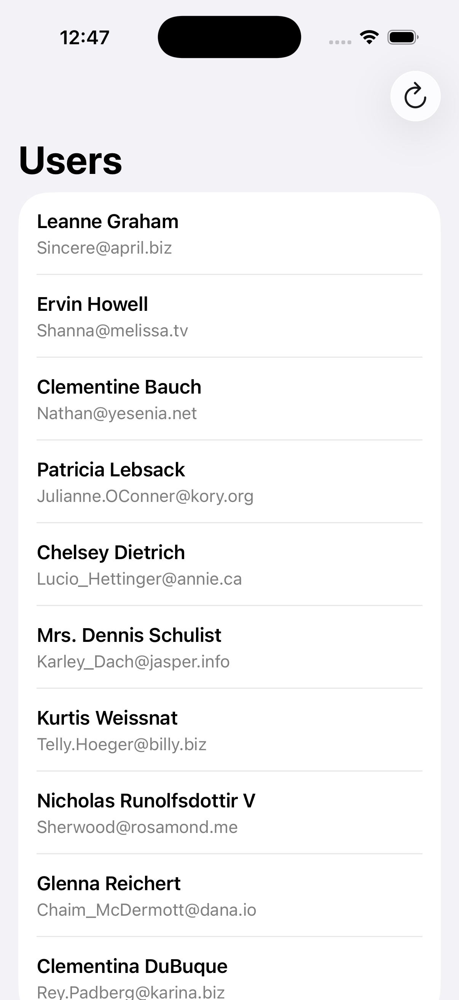
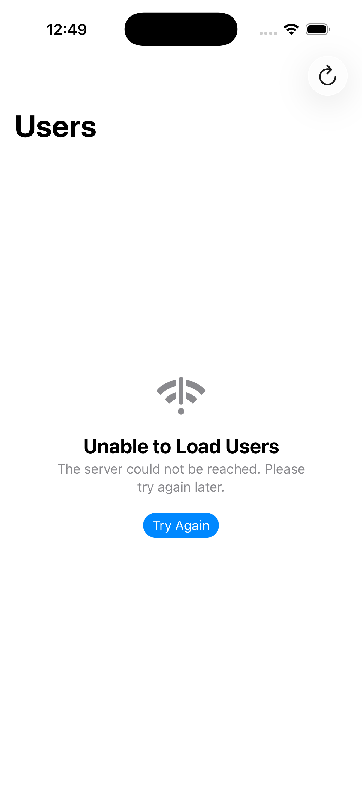

# Network Error Rescue

This case study demonstrates how a fragile SwiftUI network screen was turned into a resilient, testable experience.

## Before

- Networking and decoding lived directly in the SwiftUI view.
- Errors were silently discarded with `try?`.
- Repeated taps could launch duplicate requests.
- Loading, empty, and failure states looked identical.
- The behavior could not be tested without real networking.

See commit `4404d59` for the intentionally fragile version.

## After

- A protocol-based service owns networking and response validation.
- A `@MainActor` view model owns UI state and prevents duplicate loads.
- The screen displays loading, empty, offline, timeout, and retry states.
- Pull-to-refresh and accessible labels improve usability.
- Unit tests cover success, offline failure, and empty results without network access.

### Successful load

### Actionable failure state

## Run

1. Open `NetworkErrorRescue.xcodeproj` in Xcode.
2. Select an iOS 17.6 or later simulator.
3. Run the `NetworkErrorRescue` scheme.
4. Run the test target with **Product > Test**.
